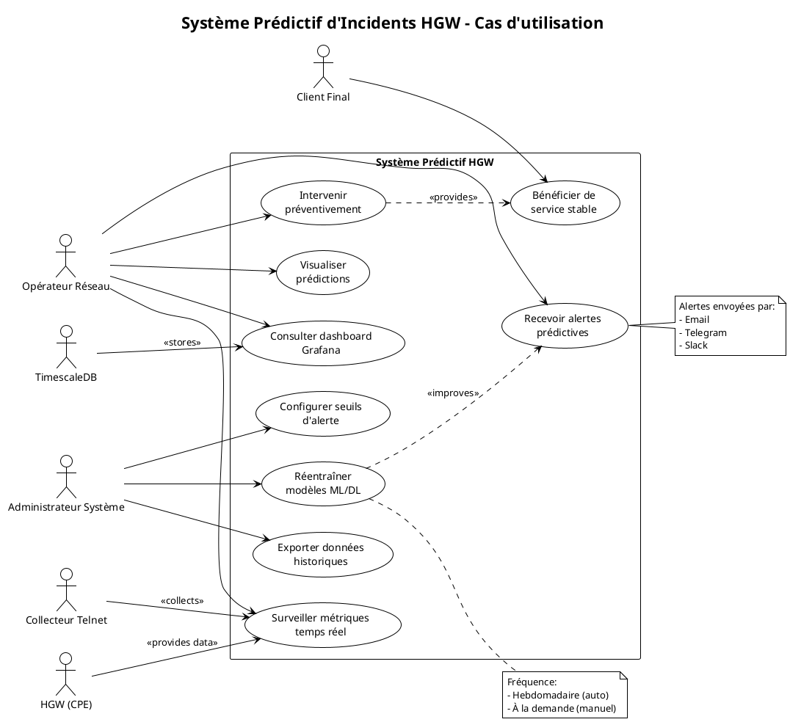
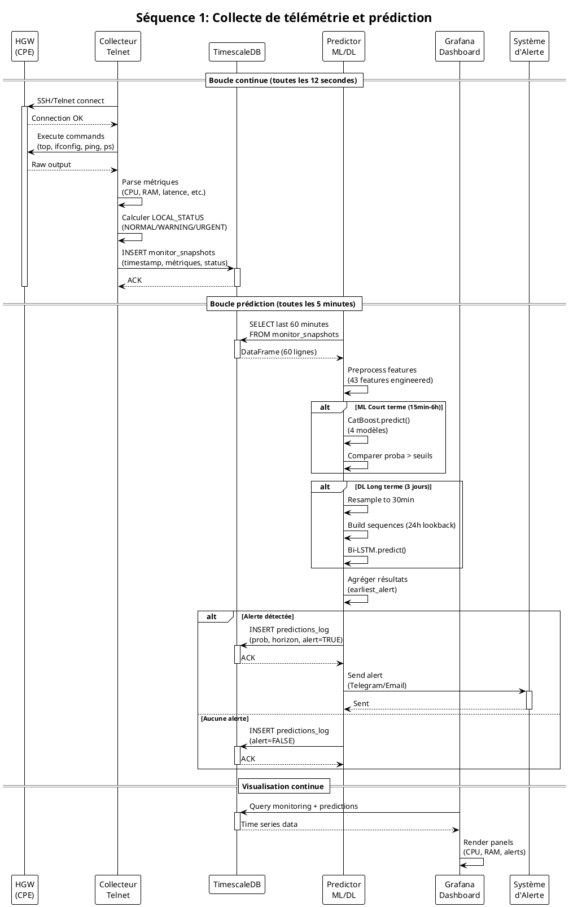
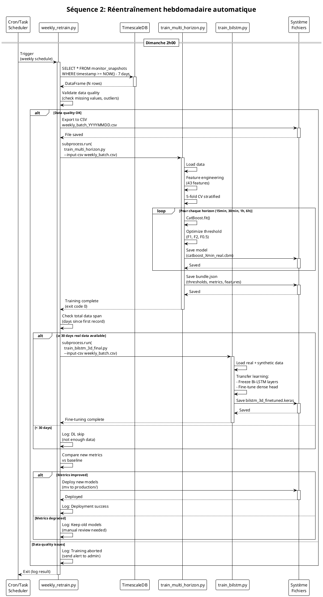
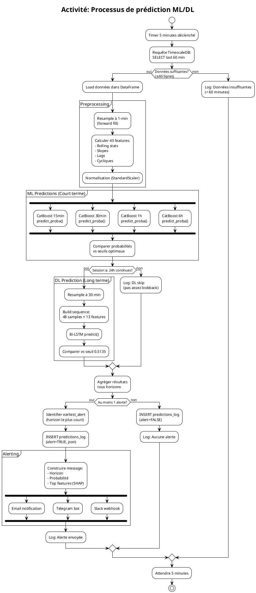
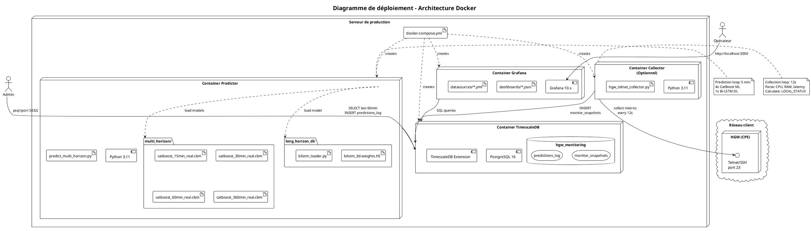
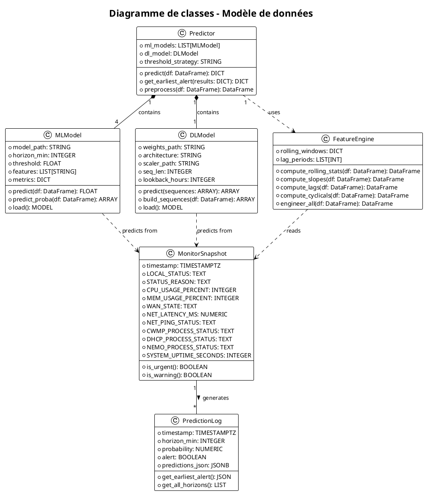

# Diagrammes UML — Système Prédictif HGW

Ce fichier contient tous les diagrammes PlantUML du projet.  
Utilisez https://www.plantuml.com/plantuml/ ou un plugin IDE pour générer les images.

---

## 1. Diagramme de cas d'utilisation (Use Case)

---

## 2. Diagramme de séquence — Collecte et prédiction

---

## 3. Diagramme de séquence — Réentraînement hebdomadaire

---

## 4. Diagramme d'activité — Processus de prédiction

---

## 5. Diagramme de déploiement (Deployment)

---

## 6. Diagramme de classes — Modèle de données

---

## Description pour IA / Rapport

### Contexte du projet

**Titre** : Système prédictif d'incidents sur Home Gateways (HGW)

**Objectif** : Développer un système de monitoring intelligent capable de prédire les pannes matérielles et logicielles sur des équipements réseau résidentiels (HGW/CPE) avant qu'elles ne surviennent, permettant ainsi une intervention préventive.

**Technologies** :
- **Backend** : Python 3.11, TensorFlow 2.15, CatBoost 1.2, scikit-learn
- **Base de données** : TimescaleDB (PostgreSQL optimisé séries temporelles)
- **Visualisation** : Grafana
- **Déploiement** : Docker, Docker Compose
- **Collecte** : Telnet/SSH vers CLI HGW

### Architecture fonctionnelle

Le système s'articule autour de 4 composants principaux :

1. **Collecteur de télémétrie** : Connexion automatisée toutes les 12 secondes au HGW via Telnet/SSH, exécution de commandes système (`top`, `ifconfig`, `ping`, `ps`), parsing des sorties, calcul d'un statut local (NORMAL/WARNING/URGENT), insertion dans TimescaleDB.

2. **Moteur de prédiction hybride ML/DL** :
   - **Tier ML (court terme)** : 4 modèles CatBoost entraînés sur données réelles, prédiction à 15min, 30min, 1h, 6h
   - **Tier DL (long terme)** : 1 modèle Bi-LSTM entraîné sur données synthétiques, prédiction à 3 jours
   - Exécution toutes les 5 minutes sur fenêtre glissante de 60 minutes
   - Feature engineering : 43 features (rolling stats, slopes, lags, cycliques, interactions)

3. **Système d'alerting** : Comparaison des probabilités prédites vs seuils optimisés (F1, F2, F0.5), identification de l'alerte la plus urgente, notification multi-canal (Telegram, Email, Slack) avec détails (horizon, probabilité, top features contributives via SHAP).

4. **Dashboard Grafana** : Visualisation temps réel des métriques (CPU, RAM, latence), état système, historique des prédictions, configuration des alertes Grafana natives.

### Workflow de prédiction

1. Timer déclenche requête TimescaleDB (SELECT last 60 min)
2. Preprocessing : resample 1-min, feature engineering (43 features)
3. Prédiction ML : 4 modèles CatBoost en parallèle
4. Prédiction DL : Si ≥24h lookback, Bi-LSTM sur séquences 30-min
5. Agrégation : Identifier earliest_alert (horizon le plus court)
6. Si alerte : INSERT predictions_log + envoi notifications
7. Sinon : INSERT predictions_log (alert=FALSE)
8. Grafana lit predictions_log et affiche courbes

### Réentraînement automatique

Chaque dimanche à 2h :
1. Export 7 derniers jours depuis TimescaleDB → CSV
2. Validation qualité données (missing values, outliers)
3. Entraînement 4 modèles CatBoost (5-fold CV)
4. Si ≥30 jours données : Fine-tuning Bi-LSTM (transfer learning)
5. Comparaison métriques vs baseline
6. Déploiement si amélioration constatée

### Performance

**ML (validation 5-fold CV sur 7.5j réels)** :
- 15min : PR-AUC 0.979, Recall 94.6%
- 30min : PR-AUC 0.989, Recall 99.3%
- 1h : PR-AUC 0.994, Recall 96.1%
- 6h : PR-AUC 0.996, Recall 99.3%

**DL (test set 15% synthétique)** :
- 3j : PR-AUC 0.962, Recall 99.1% (10/1167 incidents manqués)

**Test production** : 4/5 incidents réels détectés 5 min avant occurrence (80%).

### Déploiement Docker

3 containers orchestrés via docker-compose :
- `timescaledb` : PostgreSQL 16 + TimescaleDB (port 5432)
- `grafana` : Dashboard (port 3000)
- `predictor` : Service Python avec modèles embarqués

Volumes persistants pour données DB et config Grafana.
Health checks configurés sur tous services.

### Limites et perspectives

**Limites actuelles** :
- Modèle DL entraîné sur synthétique (7.5j réels insuffisants pour horizon 3j)
- Single-gateway (généralisation multi-HGW non validée)
- Features process-level manquantes (cwmp_rss, dhcp_rss, nemo_rss)

**Roadmap** :
- Collecte continue 30+ jours → Fine-tuning DL sur données réelles
- Modèle 7 jours
- Déploiement multi-HGW
- API REST
- AutoML pour optimisation continue
- Explainability avancée (LIME interactif)
